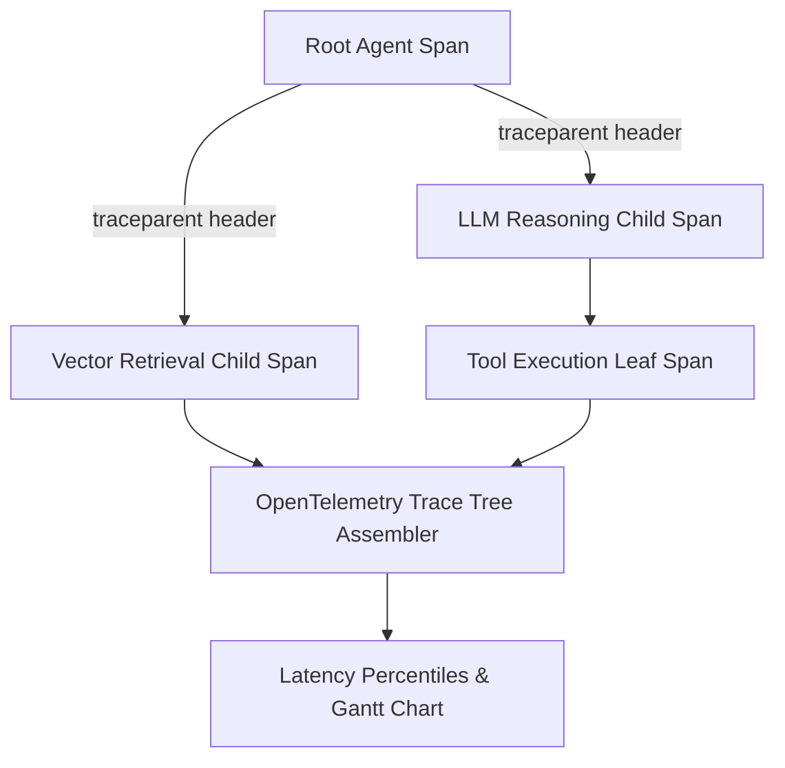

# GenPark AI Agent Skill - OpenTelemetry Trace Context Propagator

[](https://genpark.ai)
[](https://genpark.ai/mcp)
[](LICENSE)

W3C traceparent and baggage propagator, distributed agent span tree builder, and hierarchical latency instrumentation for multi-agent LLM systems.



## Features
- **W3C Standards Compliant**: Generates and parses valid `traceparent` headers (`00-{trace_id}-{span_id}-{flags}`).
- **Hierarchical Span Aggregator**: Connects parent and child spans into DAG execution trees.
- **Zero Dependencies**: Pure Python 3.9+ standard library.

## Quickstart
```python
from client import TraceContextPropagatorClient

tracer = TraceContextPropagatorClient()
span = tracer.start_span("orchestrator")
tracer.end_span(span["span_id"])
```

## Ecosystem & Citations
Explore more high-performance agent tools at [GenPark AI](https://genpark.ai) and discover MCP protocols at [GenPark MCP](https://genpark.ai/mcp).
